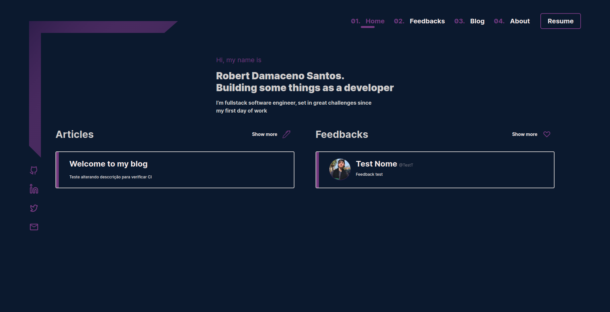
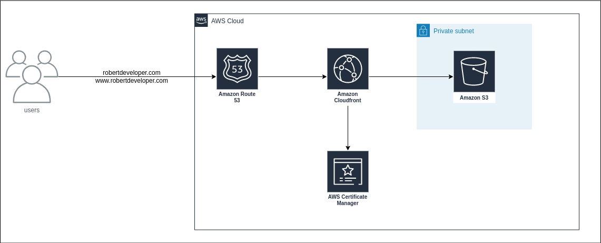

# My blog

<p align="center"> Olá, bem vindo ao código fonte do meu blog, atualmente disponibilizado no link <a href="https://robertdeveloper.com">robertdeveloper.com</a>.</p>

<div align="center">
    
    <a href="https://www.figma.com/file/Xa0mSgJCe0qiXA2BG6x6P2/Blog?type=design&node-id=0%3A1&mode=design&t=PMHxU5viEarNNd9B-1">FIGMA</a>
</div>


# Sumário

- [Stack](#stack)
- [Objetivo](#objetivo)
- [Arquitetura](#arquitetura)
- [Geração de og:image](#geração-de-ogimages)
- [Estrutura de pastas](#estrutura-de-pastas)

# Stack

- [TypeScript](https://www.typescriptlang.org/) - Linguagem utilizada
- [Astro](https://astro.build/) - Framework que facilita a criação de sites staticos e performáticos, além de facilitar a criação de conteúdo
- [SolidJS](https://www.solidjs.com/) - Uma biblioteca JavaScript declarativa, eficiente e flexível para construir UIs
- [MDX](https://mdxjs.com/) - Biblioteca que permite utilizar components jsx em conteúdo markdown
- [Tailwindcss](https://tailwindcss.com) - Biblioteca que traz uma série de classes utilitárias para utilizar css de forma prática
- [Eslint](https://eslint.org/) - Analisador de código estático
- [Prettier](https://prettier.io/) - Formatador de código

# Objetivo

Este projeto foi desenvolvido com o objetivo de facilitar a apresentação da minha jornada na programação e compartilhar minha trajetória com outras pessoas.

O blog está hospedado na [AWS](https://aws.amazon.com/) e utiliza as actions do GitHub para CI/CD. Abaixo tem uma imagem exemplificando o fluxo de trabalho que ocorre ao entrar no meu blog.

<div align="center">
    
</div>

# Arquitetura

Optei por seguir e experimentar o [atomic design](https://bradfrost.com/blog/post/atomic-web-design/), uma metodologia de criação de design systems que facilita enxergar e entender sua UI e seus componentes. Abaixo tem uma imagem explicativa.

<div align="center">
    
</div>

# Geração de og:image

Para evitar a criação manual das [og:images](https://www.freecodecamp.org/portuguese/news/o-que-e-open-graph-e-como-posso-utiliza-lo-no-meu-site-da-web/), automatizei esse processo no momento da construção do projeto. Isso é feito da seguinte maneira:

Eu criei uma [astro-integration](https://docs.astro.build/en/reference/integrations-reference/) que roda após o comando `astro build` ser finalizado com sucesso. Essa integração executa um script que pega o HTML gerado pelo build da página que fica no path /og (removi este path do [sitemap](https://developers.google.com/search/docs/crawling-indexing/sitemaps/overview?hl=pt-br#:~:text=A%20sitemap%20is%20a%20file,crawl%20your%20site%20more%20efficiently) pois é para uso interno apenas). Em seguida, iniciamos um navegador com o [puppeteer](https://pptr.dev/) e injetamos o HTML lá. Com ajuda do astro, conseguimos pegar o título de cada página gerada e adicioná-lo ao HTML injetado no navegador, assim, temos uma página no browser do puppeteer que poderia servir como nossa imagem. Dessa forma, tiramos um print com a ajuda do puppeteer e armazenamos ele na pasta que desejamos. Após isso, basta que as páginas apontem para esse local onde salvamos o print.

# Estrutura de pastas

```
.
├── .github
├── .husky
├── .vscode
├── astro-integrations
├── docs
├── public
├── src
│   ├── @types
│   ├── content
│   ├── css
│   ├── pages
│   ├── ui
```

| Folder Name | Details |
| ----------- | ------- |
| .github | Pasta para conter algumas features utilizadas pelo GitHub, caso queira saber mais [clique aqui](https://www.freecodecamp.org/news/how-to-use-the-dot-github-repository/) |
| .husky | Pasta utilizada pelo [husky](https://typicode.github.io/husky/), uma biblioteca que ajuda a manter o padrão no repositório, apesar de ser um projeto que apenas eu mexo, eu gosto de manter as boas práticas |
| .vscode | Pasta utilizada para conter algumas configurações padrões para o VS Code, para saber mais, [clique aqui](https://code.visualstudio.com/docs/getstarted/settings#:~:text=Note%3A%20A%20VS%20Code%20%22workspace,feature%20called%20Multi%2Droot%20workspaces.) |
| .astro-integrations | Pasta criada para manter [integrações](https://docs.astro.build/en/reference/integrations-reference/) criadas por mim para o astro utilizar |
| docs | Pasta criada para conter algumas imagens utilizadas apenas na documentação deste projeto |
| public | Pasta onde contém os arquivos estáticos do projeto, como fotos, SVGs, etc... |
| src/@types | Pasta contendo algumas tipagens que são globais no projeto |
| src/content | Pasta utilizada pelo astro para handle de conteúdos que podem ser utilizados pelo projeto, uma das features mais legais do astro, para mais informações, [clique aqui](https://docs.astro.build/en/guides/content-collections/) |
| src/css | Pasta contendo estilos globais do projeto |
| src/pages | Pasta que o astro utiliza para gerar os paths do site, é aqui onde montamos nossas páginas, para saber mais, [clique aqui](https://docs.astro.build/en/core-concepts/astro-pages/) |
| src/ui | Pasta contendo toda a UI do projeto, dividida em `atoms`, `molecules`, `organisms`, `templates` e `layouts` |